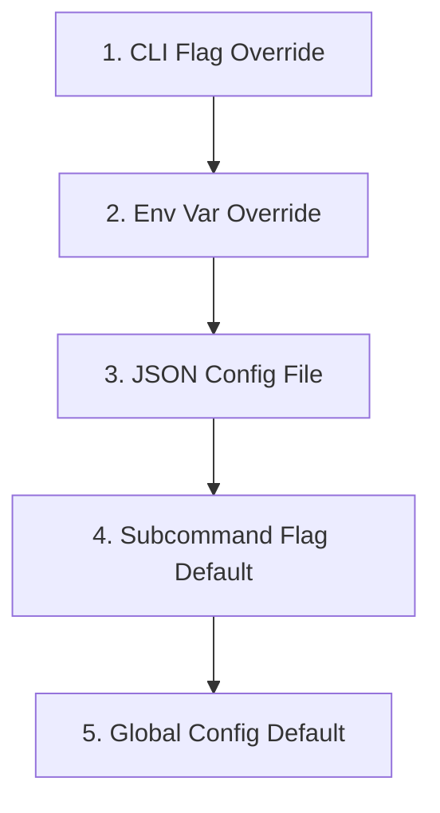

# min CLI Framework

`min` is a lightweight, declarative, and type-safe CLI boilerplate framework built in Go using `github.com/alecthomas/kong`. 

It is designed to be completely reusable, allowing developers to add new subcommands or configuration properties by editing only Go structs.

## Features
- **Strict Override Specificity**: `CLI flag > Env Var > Config File > Subcommand Default > Root Default` resolved universally.
- **Root Command Cleanliness**: Config options are only exposed on subcommands that explicitly define them, preventing global option pollution on the root `--help` output.
- **Collision-Free Path Mapping**: Subcommand flags map strictly to nested global configuration properties based on their Go structure paths, preventing naming collisions.
- **Vanilla Go Type Safety**: Leverages Go's native type system without requiring custom parser wrappers or complex serialization unmarshalers.
- **Automatic Environment Variable Documentation**: Derived environment variables are documented dynamically on command-line `--help` screens.

---

## Developer Guide: Adding & Configuring Subcommands

This section explains how to add new subcommands, configure flags, and bind options to the global configuration.

### 1. How to Add a New Subcommand

Adding a subcommand involves three steps:

#### Step 1: Define the Command Struct
Create a new struct representing the command. Any fields defined inside this struct will automatically become command-line flags or positional arguments.

```go
type DiagnosticCmd struct {
    Verbose bool `short:"v" help:"Enable verbose diagnostic output."`
}
```

#### Step 2: Implement the `Run` Method
Implement a `Run` method for your struct. Kong automatically injects dependencies (like the global `*Config` or `ConfigPath`) when executing the method:

```go
func (cmd *DiagnosticCmd) Run(cfg *Config) error {
    if cmd.Verbose {
        fmt.Println("Running verbose diagnostics...")
    }
    fmt.Printf("Admin Token: %s\n", cfg.AdminToken)
    return nil
}
```

#### Step 3: Register the Subcommand
Add your new command to the root `CLI` struct inside `main.go` using the `cmd:""` tag:

```go
type CLI struct {
    ConfigFile string `help:"Path to config file." placeholder:"PATH"`

    Config     ConfigCmdGroup `cmd:"" help:"Manage application configuration"`
    Greet      GreetCmd       `cmd:"" help:"Print a personalized greeting message"`
    Diagnostic DiagnosticCmd  `cmd:"" help:"Run system diagnostic suite"` // Registered!
}
```

---

### 2. Kong Struct Tags & Their Effects

Kong parses command-line arguments dynamically based on struct tags. Here is a comprehensive reference of all available tags:

| Struct Tag | Applied To | Description | Example |
| :--- | :--- | :--- | :--- |
| `cmd` | Struct Fields | Marks a nested struct as a subcommand (command group). | `cmd:""` |
| `arg` | Fields | Marks the field as a positional argument instead of a flag. | `arg:""` |
| `help` | Fields | Sets the description text printed in `--help`. | `help:"Detailed desc"` |
| `default` | Fields | Defines the fallback default value. | `default:"10s"` |
| `short` | Fields | Single-character short flag alias. | `short:"s"` |
| `placeholder`| Fields | Placeholder name shown for flags expecting values. | `placeholder:"PATH"` |
| `required` | Fields | Fails parsing if the flag/argument is omitted. | `required:""` |
| `xor` | Fields | Mutually exclusive flag group. Only one can be set. | `xor:"output-group"` |
| `name` | Fields | Overrides the generated CLI flag name. | `name:"json-out"` |

---

### 3. Configuration & Specificity Precedence

Any option defined on a subcommand that matches a key in the global `Config` struct (matched using kebab-case paths, e.g. `CoreTimeout` mapping to `core.timeout`) automatically inherits the full configuration hierarchy.

The priority order is strictly resolved as follows:



#### Flag Name and Path Mapping
The framework automatically maps subcommand options to global configuration properties:
- If you define `CoreTimeout string` on your subcommand, it maps strictly to `core.timeout` in `Config` (env: `$MIN_CORE_TIMEOUT`).
- Any flag name that does not match a global config field (e.g. if you define a local option `Timeout string`) remains entirely local to the subcommand and does not conflict with the global configuration.

#### Crucial: Field Naming Rules
Because the framework maps subcommand flags dynamically, **the field name in your subcommand struct must reflect the Go structure path of the target global configuration property**:
- To map to global `Config.Core.Timeout` (flat key `"core-timeout"`), the subcommand option field **must be named `CoreTimeout`** to produce the flag `--core-timeout`.
- If you name the field `Timeout`, it will produce the flag `--timeout`, which does not match `"core-timeout"` and will act only as a local command flag without inheriting configuration or environment variable overrides.

#### Duplicate Key Detection
To ensure configuration integrity, the framework enforces unique leaf-level paths within the JSON configuration file:
- If the configuration file defines the same setting in multiple forms (e.g. including flat `"core-timeout": "5m"` at the root level and nested `"core": {"timeout": "10m"}`), the parser will fail immediately with a validation error:
  `error: both "core-timeout" and "core.timeout" map to the same configuration field at /home/dat/.config/min/min.json`
