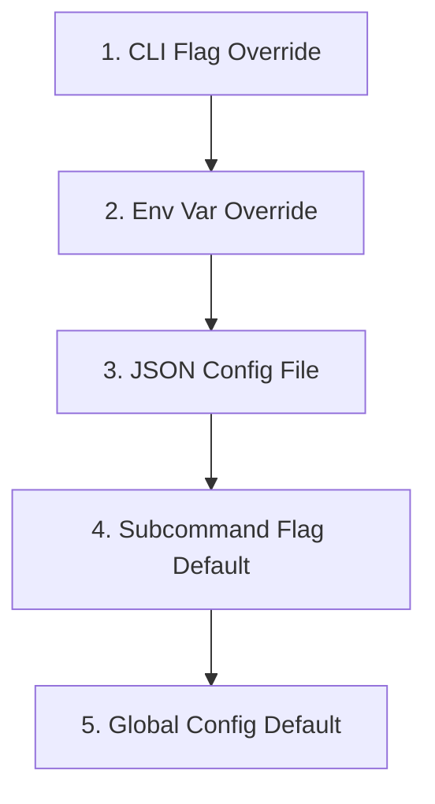

# Developer Guide: Adding & Configuring Subcommands

This guide explains how to add new subcommands, configure flags, and bind options to the global configuration in the `min` CLI framework.

---

## 1. How to Add a New Subcommand

Adding a subcommand involves three steps:

### Step 1: Define the Command Struct
Create a new struct representing the command. Any fields defined inside this struct will automatically become command-line flags or positional arguments.

```go
type DiagnosticCmd struct {
    Verbose bool `short:"v" help:"Enable verbose diagnostic output."`
}
```

### Step 2: Implement the `Run` Method
Implement a `Run` method for your struct. Kong automatically injects dependencies (like the global `*Config` or `ConfigPath`) when executing the method:

```go
func (cmd *DiagnosticCmd) Run(cfg *Config) error {
    if cmd.Verbose {
        fmt.Println("Running verbose diagnostics...")
    }
    fmt.Printf("Admin Token: %s\n", cfg.AdminToken)
    return nil
}
```

### Step 3: Register the Subcommand
Add your new command to the root `CLI` struct inside `main.go` using the `cmd:""` tag:

```go
type CLI struct {
    ConfigFile string `help:"Path to config file." placeholder:"PATH"`

    Config     ConfigCmdGroup `cmd:"" help:"Manage application configuration"`
    Greet      GreetCmd       `cmd:"" help:"Print a personalized greeting message"`
    Diagnostic DiagnosticCmd  `cmd:"" help:"Run system diagnostic suite"` // Registered!
}
```

---

## 2. Kong Struct Tags & Their Effects

Kong parses command-line arguments dynamically based on struct tags. Here is a comprehensive reference of all available tags:

| Struct Tag | Applied To | Description | Example |
| :--- | :--- | :--- | :--- |
| `cmd` | Struct Fields | Marks a nested struct as a subcommand (command group). | `cmd:""` |
| `arg` | Fields | Marks the field as a positional argument instead of a flag. | `arg:""` |
| `help` | Fields | Sets the description text printed in `--help`. | `help:"Detailed desc"` |
| `default` | Fields | Defines the fallback default value. | `default:"10s"` |
| `short` | Fields | Single-character short flag alias. | `short:"s"` |
| `placeholder`| Fields | Placeholder name shown for flags expecting values. | `placeholder:"PATH"` |
| `required` | Fields | Fails parsing if the flag/argument is omitted. | `required:""` |
| `xor` | Fields | Mutually exclusive flag group. Only one can be set. | `xor:"output-group"` |
| `name` | Fields | Overrides the generated CLI flag name. | `name:"json-out"` |

---

## 3. Configuration & Specificity Precedence

Any option defined on a subcommand that matches a key in the global `Config` struct (matched using kebab-case or prefix suffixes, e.g. `CoreTimeout` or `Timeout` mapping to `core.timeout`) automatically inherits the full configuration hierarchy.

The priority order is strictly resolved as follows:



### Flag Name and Path Mapping
The framework automatically maps subcommand options to global configuration properties:

- If you define `CoreTimeout Duration` on your subcommand, it maps to `core.timeout` in `Config` (env: `$MIN_CORE_TIMEOUT`).
- If you define `Timeout Duration` on your subcommand, it also maps to `core.timeout` (env: `$MIN_TIMEOUT`).

### Specificity Best Practice
- If a parameter is a global config option (e.g. `CoreTimeout`), define its primary fallback default tag on the `Config` struct in `main.go`.
- If a subcommand needs to run with a more specific timeout default than the rest of the application, define the `default:"<value>"` tag on that subcommand's option (e.g., `default:"10s"` on the subcommand flag). The framework will automatically prefer the subcommand's default over the global default when no config file or env var is set.
